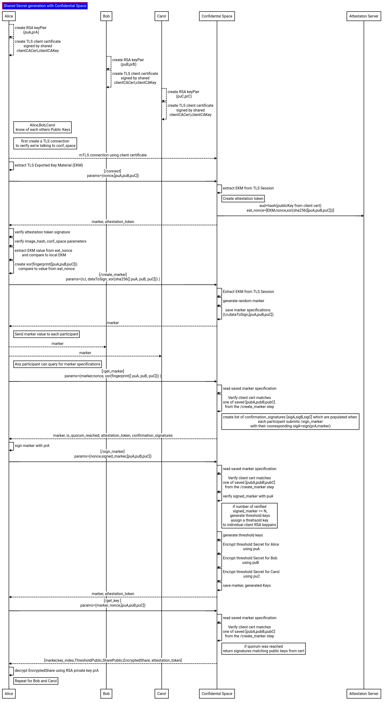

## Generate 

  - [Server](#generate-server)
  - [Client](#generate-client)  
  
There are several core concepts related to this protocol:

#### Participant RSA Key Generation

Key generation basically involves each participant creating an RSA key pair locally submitting their _RSA_ public key to the TEE/server.

Each other participant can optionally trust other participants RSA Public Key.  This is not necessary but helps each participant know who the other participants are (or atleast the other participants public key).

This protocol requires each participant to digitally sign some data using the RSA Private key and submit that to the Server.  The server will verify the signature and use that as confirmation a participant has ownership of that keypair and is in agreement to issue the threshold key specifications and other participants.

Once the server accumulates enough confirmations from participants to generate the threshold keys, the server create all the threshold keypairs, encrypt each threshold private key key using a participants public RSA Public Key and return that specific threshold private share along with the VM's attestation token to each participant who owns the respective public RSA.

#### Exported Key Material (EKM)

Each end of a TLS session can derive a unique key from the shared master secret which can be used for application-level protocol.  Basically, you can use the EKM to assert some application-level logic to the TLS session. Most commonly, this means is you can perform `Channel Binding`` where with a client-server system some application layer context is bound to the connection channel (TLS)

for more information, see [Exported Key Material (EKM) in golang and openssl](https://github.com/salrashid123/go_ekm_tls)

#### Confidential Space Attestation Token

Google Confidential Space is a TEE running as a VM which just runs one container image.  It offers an isolated runtime environment where not even google or the operator of the VM can view its data or memory.  An application running in confidential space can acquire an attestation token _only from inside_ the VM and given the token, a remote party can externally verify several things about its runtime:

* what is the current container `image_hash` that is running
* what is that image's runtime arguments and environment variables
* is this running in confidential_space debug or prod runtime and what is its software version, secure boot status, etc
* what is the project, zone, unique vm instance_id
* is memory encryption enabled (AMD SEV)
* confirmation that ssh and external access to the runtime is disabled

many more

If the application inside confidential space emits that token, a remote party can easily verify the JWT and claims.

Signature verification is done though a JWK endpoint jwks_uri like any standard OIDC provider.

In context with this repo, we will encode  various [custom claims](https://github.com/salrashid123/confidential_space/blob/main/README.md#custom-attestation-token) denoting threshold participants, EKM values and various other fields into the claims.  A participant can use this signed jwt to confirm they are infact talking to a TEE, who the participants are, etc.

#### Protocol Marker

This protocol starts with one of the participants initiating it all.  The participant who has all the RSA Public keys will supply those public keys to the TEE/Server and acquire a unique UID from the server which encodes the specifications of the session.

This marker will need to get distributed to other participants so they can confirm its use and recieve their threshold share.

Note, the protocol here is such that the marker specifications and operations against it can only get recalled by the participants owning the private RSA key.

Its probably easiest to walk through an API flow.

First a glossary 

* `marker`:  this is a UUID which signifies the parameters of the key to generate.  Any operation against the marker requires a participants RSA key
  Think of this as a unique index value each participant uses to coordinate key transfers and knowing it does not expose anything.  
  The uuid van only get generated by the server.
* `participant_public_keys`:  Represents the list of RSA public keys the server uses to attest mTLS session from each client.  The private key is generated at the client and is used for mTLS and to decrypt their threshold secret. 
* `marker_signature`: Represents the list of RSA _signatures_ values for the marker for each participant.  This is used to confirm that each participant was in agreement with the marker specifications
* `attestation_jwt`: The Confidential space JWT token used by participants to verify server characteristics.  The JWT allows for custom `eat_nonce` values which the server can specify.

---

The following shows the API call flow involved 

#### `/connect`

The first and continuous step in any API call is for each client to confirm they are infact talking **directly** with a TEE on GCP Confidential space.

This is done by deriving the EKM value for the clients connection and getting the signed attestation jwt back from the server which includes that value.  Both the client and server derived the same value and that can only happen if the server terminated the TLS session.

The client will then verify the returned JWT from the server and compare against its value it got.   Once confirmed, the client will reusue this TLS connection.

Snippet below shows the API request/response and the values encoded into the attestation JWT

Note that the client establishes all communication for all APIs using `mTLS` where the private key is the RSA keypair that was generated locally.  The client certificate is signed by a local CA that the server allows connection from. 

* `participant_public_keys`: this is a list of the public keys used in the protocol.  The server will ensure the remote peer in the mTLS connection (the participant) has created the connection using a private key bound to one of the public keys in the list.  A hash of all the public keys are `XOR()` together and sent back to the client

* `nonce`: a unique nonce the client sends that is sent back to the client and encoded into the JWT

```golang
type BaseRequest struct {
	ParticipantPublicKeys [][]byte `json:"participant_public_keys"`
}

type ConnectRequest struct {
	Nonce string `json:"nonce"`
	BaseRequest
}

type ConnectResponse struct {
	Nonce          string `json:"nonce"`
	AttestationJWT string `json:"attestation_jwt"`
}

// val.PublicKeyXOR == XOR(fingerprint(publicKeyA),fingerprint(publicKeyB),fingerprint(publicKeyC)) )
customTokenValue, err := tk.GetCustomAttestation(&tk.CustomToken{
		Audience:  val.PeerPublicKeyHash,
		Nonces:    []string{val.EKM, post.Nonce, val.PublicKeyXOR},
		TokenType: TOKEN_TYPE_OIDC,
	})
```

- `audience` value in the returned jwt is the hash of the client's mTLS public key (not public x509 certificate).

- `PublicKeyXOR` is just `XOR(fingerprint(publicKeyA), fingerprint(publicKeyB), ...)` which given a set will arrive at the same value regardless of the order of the keys

#### `/create_marker`

After the initial connection step which establishes the `client->>TEE` attestation step is for any participant to initialize a marker by specifying the `t,n` values as well as the index-ordered list of all participants RSA public keys

* `n`: total threshold keys
* `t`: minimum number of threshold keys required to sign)
* `data_to_sign`: random data that each participant must sign with their RSA private key as confirmation they approve the marker's specifications.

```golang
type CreateMarkerRequest struct {
	T          int32  `json:"t"`
	N          int32  `json:"n"`
	DataToSign []byte `json:"data_to_sign"`
	BaseRequest
}

type CreateMarkerResponse struct {
	Uid            string `json:"uid"`
	AttestationJWT string `json:"attestation_jwt"`
}

// create custom jwt which includes the EKM, marker and the xor of all the hashes of all the RSA public keys
customTokenValue := &tk.CustomToken{
		Audience:  val.PeerPublicKeyHash,
		Nonces:    []string{val.EKM, uid, val.PublicKeyXOR},
		TokenType: tk.TOKEN_TYPE_OIDC,
	}
```

As stated, the marker is just an opaque uid/sessionID value that the server uses as a reference value.  The server saves a lookup table for each marker where the data denotes the state and specifications:

The values stored in the database are:

```golang
type KeyShare struct {
	Index                    int    `json:"index"`   // index value of the threshold partial key
	PublicKey                []byte `json:"public_key"`  // RSA public key
	PublicKeyHash            []byte `json:"public_key_hash"`  // sha256 of the RSA public key
	SharePublic              []byte `json:"sharePublic"`   // the share's Threshold Public Key 
	EncryptedSharePrivateKey []byte `json:"encrypted_share_private_key"`  // the shares Threshold Private key encrypted with the RSA Public key
	ProvidedSignature        []byte `json:"provided_signature"`  // RSA signature for the `data_to_sign` value
}

type KeyState struct {
	T                  int32       `json:"t"`   // number of partial keys needed for threshold
	N                  int32       `json:"n"`   // total number of participants
	Marker             string      `json:"marker"`  // the marker value itself
	SharePublicKey     []byte      `json:"share_public_key"`  // list of the RSA public keys
	KeyShares          []*KeyShare `json:"key_shares"`  // pointer back to the list of participants keys specifications
	Quorum             int32       `json:"quorum"`   // the number of participants who have so far provided their consent to issue the threshold key
	DataToSign         []byte      `json:"data_to_sign"`  // hash of the data to sign 
	PublicKeyXOR       []byte      `json:"public_key_xor"`  // the xor value of all the hashed public RSA keys 
	ParticipantKeyHash []string    `json:"participant_key_hash"`  // list of the hash of all the public RSA keys
}
```

The API will return the marker value which represents the coordination token.

This marker-token will be used by each participant in every subsequent API interaction with the server as a means to indicate the context, parameters, state and participants involved in the key generation.

This marker value cannot be unilaterally submitted (i.,e a participant can't define their own marker; it must be generated on the server)

This marker value is communicated to each participant by any means.

#### `/get_marker`

At anypoint, any participant can request to see the state and configuration settings of a given marker.

This is used to confirm the `t,n` value as well as the declared public keys that are currently involved in a key generation (eg, so that each participant knows they're working to create a known share with other users as identified by their public key)

The response from this api also includes `signature_set` which is the list of the signatures submitted by each participant that confirms the marker.  The value of each signature is the `data_to_sign` signed with the RSA private key.  This value is used to confirm that each participant is aware of the marker and its specification.  Each other participant will cross check the signature against the signers public rsa key.

Note, due to mTLS, a only the participants with the required set RSA private keys can perform any operation against a given marker

```golang
type GetMarkerRequest struct {
	Uid   string `json:"uid"`    // marker value
	Nonce string `json:"nonce"`  // random nonce to send in
	BaseRequest
}

type SignatureSet struct {
	ParticipantPublicKey []byte `json:"participant_public_key"`   // the participants RSA public key 
	ParticipantSignature []byte `json:"participant_signature"`    // the participants signature of `data_to_sign`
}

type GetMarkerResponse struct {
	Uid             string         `json:"uid"`   // marker value
	PublicKeyHashes []string       `json:"public_key_hashes"`  // hash of the rsa public keys for each participant
	SignatureSet    []SignatureSet `json:"signature_set"`      // set of individual RSA public keys and signatures
	T               int32          `json:"t"`
	N               int32          `json:"n"`
	Quorum          int32          `json:"quorum"`   // the number of participants who have submitted signatures to confirm
	DataToSign      []byte         `json:"data_to_sign"`   // the data which each participant will sign to confirm
	AttestationJWT  string         `json:"attestation_jwt"`  // the jWT shown blow
}

// create custom jwt which includes the EKM, marker, the xor of all the hashes of all the RSA public keys
customTokenValue := &tk.CustomToken{
		Audience:  val.PeerPublicKeyHash,
		Nonces:    []string{val.EKM, e.Marker, val.PublicKeyXOR},
		TokenType: tk.TOKEN_TYPE_OIDC,
	}
```

The response will display the specifications of marker, a list of the public keys involved, any signatures of the markers as well as the full JWT attestation token which the client can verify claims.  The attestation includes the original 'audience' value that was submitted in the request.

#### `/sign_marker`

Each participant will then provide proof that they own the private portion of the RSA key to each other participant and to the Server.

The client does this by signing the marker value using their private key:

`signature = sign(rsa_private_key,marker)`

Given a `signature`, the server or other participants know that a specific public key is involved with that marker transaction.

The server will read the signature and verify against the list of public RSA keys.  Once verified, the signature is accepted and the database for the marker is updated.


```golang
type SignMarkerRequest struct {
	Uid       string `json:"uid"`   // marker
	Nonce     string `json:"nonce"` // some random nonce
	Signature []byte `json:"signature"`  // signature of the data_to_sign using the participants RSA key
	BaseRequest
}

type SignMarkerResponse struct {
	Uid            string `json:"uid"`
	AttestationJWT string `json:"attestation_jwt"`
}

// create custom jwt which includes the EKM, marker, the xor of all the hashes of all the RSA public keys
customTokenValue := &tk.CustomToken{
		Audience:  val.PeerPublicKeyHash,
		Nonces:    []string{val.EKM, e.Marker, val.PublicKeyXOR},
		TokenType: tk.TOKEN_TYPE_OIDC,
	}
```


If all participants submitted their public keys, a `t of n` threshold keyset is generated

Once all the participants submit their signatures, the threshold keys are created.  Each participant gets one key that is further encrypted by their corresponding RSA Public key.

- `/get_key`

The final step is for each participant to retrieve their portion of the keyshare

```golang
type GetKeyRequest struct {
	Uid   string `json:"uid"`  // marker
	Nonce string `json:"nonce"`  // some random nonce 
	BaseRequest
}

type GetKeyResponse struct {
	Uid                   string `json:"uid"`  // marker
	Index                 int    `json:"index"`  // the index value for this threshold key
	ThresholdPublic       []byte `json:"threshold_public"`  // the overall public key
	SharePublic           []byte `json:"share_public"`  // the public key for this share
	EncryptedSharePrivate []byte `json:"encrypted_share_private"`  // the RSA encrypted private share.  This can only get decrypted if the client has the RSA private key
	AttestationJWT        string `json:"attestation_jwt"`   // attestation JWT as described below
}

// create custom jwt which includes the EKM, marker, the xor of all the hashes of all the RSA public keys
customTokenValue := &tk.CustomToken{
		Audience:  val.PeerPublicKeyHash,
		Nonces:    []string{val.EKM, e.Marker, val.PublicKeyXOR},
		TokenType: tk.TOKEN_TYPE_OIDC,
	}

```

Again, critically the threshold private key is encrypted using the RSA public key for the participant.  The client will use the RSA private key to decrypt the threshold key.



---

### Generate Server

Running locally requires `bazel` or `go 1.19+` and optionally `protoc`.

To build and run the server image,

```bash
cd generate/

# bazel run :gazelle -- update-repos -from_file=go.mod -prune=true -to_macro=repositories.bzl%go_repositories

# bazel run server:main -- --listen :8081    --tlsCert=`pwd`/certs/server.crt --tlsKey=`pwd`/certs/server.key    --tlsCA=`pwd`/certs/tls-ca-chain.pem --clientCertCA=`pwd`/certs/client-ca.crt --v=30 -alsologtostderr

crane registry serve --address :4000

# bazel run server:push-image

docker run  --net=host -e USER="$(id -u)" \
   -v $HOME/.docker/config.json:/root/.docker/config.json \
   -v `pwd`:/src/workspace   -v /tmp/build_output:/tmp/build_output \
   -v /var/run/docker.sock:/var/run/docker.sock   -w /src/workspace \
   gcr.io/cloud-builders/bazel@sha256:7c34604572d4f001928b98f2b04e2feaebce67b7933e4182b817dcbfe9904bcd run  server:push-image


## see the "Local Testing" section below
# docker run -p 8081:8081 -v `pwd`/certs/:/certs \
#     localhost:4000/generate-server@sha256:c7da9ee9a740e648c94e56cb2645897212e3be1815290ac4cf3982e8d77750a1 \
#     --listen :8081 \
#     --tlsCert=/certs/server.crt \
#     --tlsKey=/certs/server.key \
#     --tlsCA=/certs/tls-ca-chain.pem \
#     --clientCertCA=/certs/client-ca.crt --v=30 -alsologtostderr

# go run server/server.go --listen :8081 \
#    --tlsCert=certs/server.crt --tlsKey=certs/server.key \
#    --tlsCA=certs/tls-ca-chain.pem --clientCertCA=certs/client-ca.crt --v=30 -alsologtostderr
```

```bash
gcloud config configurations activate operator

export OPERATOR_PROJECT_ID=`gcloud config get-value core/project`
export OPERATOR_PROJECT_NUMBER=`gcloud projects describe $OPERATOR_PROJECT_ID --format='value(projectNumber)'`

export IMAGE_HASH="index.docker.io/salrashid123/generate-server@sha256:c7da9ee9a740e648c94e56cb2645897212e3be1815290ac4cf3982e8d77750a1"

gcloud iam service-accounts create operator-svc-account

gcloud projects add-iam-policy-binding $OPERATOR_PROJECT_ID \
  --member=serviceAccount:operator-svc-account@$OPERATOR_PROJECT_ID.iam.gserviceaccount.com  \
  --role=roles/logging.logWriter

gcloud compute instances create vm1 --confidential-compute \
 --shielded-secure-boot --tags=tee-vm --project $OPERATOR_PROJECT_ID \
 --maintenance-policy=TERMINATE --scopes=cloud-platform  --zone=us-central1-a \
 --image-project=confidential-space-images \
 --image=confidential-space-231201 \
 --service-account=operator-svc-account@$OPERATOR_PROJECT_ID.iam.gserviceaccount.com \
 --metadata ^~^tee-image-reference=$IMAGE_HASH~tee-restart-policy=Never~tee-container-log-redirect=true

export EXTERNAL_IP=`gcloud compute instances describe vm1 --project $OPERATOR_PROJECT_ID --zone=us-central1-a  --format='get(networkInterfaces[0].accessConfigs.natIP)'`
echo $EXTERNAL_IP
```


### Generate Client

```bash
# each participant creates their own RSA keypairs.  These keys can also be bound to Trusted Platform Modules (TPM); see appendix
# only the public part is known by each other participant
openssl genrsa -out 0_priv.pem 2048
openssl rsa -in 0_priv.pem -outform PEM -pubout -out 0_pub.pem

		$  openssl rsa -pubin -inform PEM -in certs/0_pub.pem -outform DER | openssl dgst -sha256 | cut -d" " -f2 
		3135b2556e76892cac85b011c39e7038b355391449f8aa5c437286efef225152

openssl genrsa -out 1_priv.pem 2048
openssl rsa -in 1_priv.pem -outform PEM -pubout -out 1_pub.pem

openssl genrsa -out 3_priv.pem 2048
openssl rsa -in 3_priv.pem -outform PEM -pubout -out 3_pub.pem    


# bazel build --platforms=@io_bazel_rules_go//go/toolchain:linux_amd64 client:all
# bazel run  --platforms=@io_bazel_rules_go//go/toolchain:linux_amd64 client:client-image

# bazel run --platforms=@io_bazel_rules_go//go/toolchain:linux_amd64 client:main -- --host localhost:8081 --mode create_marker --t 2 --n 3 --certPrefix  `pwd`/../certs/  --marker_public_keys=0_pub.pem,1_pub.pem,2_pub.pem 

go run client/client.go  --mode generate_cert  \
   --pubKey=certs/0_pub.pem --privKey=certs/0_priv.pem \
   --clientCert=certs/0_cert.crt \
   --clientCACert=certs/client-ca.crt --clientCAKey=certs/client-ca.key 

go run client/client.go  --mode generate_cert  \
   --pubKey=certs/1_pub.pem --privKey=certs/1_priv.pem \
   --clientCert=certs/1_cert.crt \
   --clientCACert=certs/client-ca.crt --clientCAKey=certs/client-ca.key

go run client/client.go  --mode generate_cert  \
   --pubKey=certs/2_pub.pem --privKey=certs/2_priv.pem \
   --clientCert=certs/2_cert.crt \
   --clientCACert=certs/client-ca.crt --clientCAKey=certs/client-ca.key      


go run client/client.go   --host $EXTERNAL_IP:8081 --mode create_marker \
   --TLSCACert=certs/tls-ca-chain.pem --clientCert=certs/0_cert.crt --privKey=certs/0_priv.pem  \
   --t 2 --n 3 --audience=some-long-unique-nonce-value \
   --marker_public_keys=certs/0_pub.pem,certs/1_pub.pem,certs/2_pub.pem   --v=10 --alsologtostderr

export MARKER=850f5222-b94c-49fc-8690-8f5542f12ace 

go run client/client.go \
 --host $EXTERNAL_IP:8081 --mode get_marker \
  --TLSCACert=certs/tls-ca-chain.pem  --clientCert=certs/0_cert.crt --privKey=certs/0_priv.pem \
  --marker_public_keys=certs/0_pub.pem,certs/1_pub.pem,certs/2_pub.pem --marker $MARKER --audience=some-long-unique-nonce-value  --v=20 --alsologtostderr

go run client/client.go  --host $EXTERNAL_IP:8081 --marker $MARKER --mode sign_marker \
  --TLSCACert=certs/tls-ca-chain.pem --clientCert=certs/0_cert.crt --privKey=certs/0_priv.pem \
  --marker_public_keys=certs/0_pub.pem,certs/1_pub.pem,certs/2_pub.pem  --v=20 --alsologtostderr

go run client/client.go  --host $EXTERNAL_IP:8081 --marker $MARKER --mode sign_marker \
  --TLSCACert=certs/tls-ca-chain.pem --clientCert=certs/1_cert.crt --privKey=certs/1_priv.pem \
  --marker_public_keys=certs/0_pub.pem,certs/1_pub.pem,certs/2_pub.pem  --v=20 --alsologtostderr

go run client/client.go  --host $EXTERNAL_IP:8081 --marker $MARKER --mode sign_marker \
  --TLSCACert=certs/tls-ca-chain.pem --clientCert=certs/2_cert.crt --privKey=certs/2_priv.pem \
  --marker_public_keys=certs/0_pub.pem,certs/1_pub.pem,certs/2_pub.pem   --v=20 --alsologtostderr

go run client/client.go  --host $EXTERNAL_IP:8081 --marker $MARKER --mode get_key --TLSCACert=certs/tls-ca-chain.pem --clientCert=certs/0_cert.crt  \
    --privKey=certs/0_priv.pem    --marker_public_keys=certs/0_pub.pem,certs/1_pub.pem,certs/2_pub.pem   --audience some-long-unique-nonce-value-a --v=10 --alsologtostderr

go run client/client.go  --host $EXTERNAL_IP:8081 --marker $MARKER --mode get_key --TLSCACert=certs/tls-ca-chain.pem --clientCert=certs/1_cert.crt  \
    --privKey=certs/1_priv.pem    --marker_public_keys=certs/0_pub.pem,certs/1_pub.pem,certs/2_pub.pem  --audience some-long-unique-nonce-value-b --v=10 --alsologtostderr

go run client/client.go  --host $EXTERNAL_IP:8081 --marker $MARKER --mode get_key --TLSCACert=certs/tls-ca-chain.pem --clientCert=certs/2_cert.crt  \
    --privKey=certs/2_priv.pem    --marker_public_keys=certs/0_pub.pem,certs/1_pub.pem,certs/2_pub.pem   --audience some-long-unique-nonce-value-c	--v=10 --alsologtostderr
```


### Trusted Platform (TPM) based Public Keys

Note, the public key can be generated by each client or can be a remote system's `Trusted Platform Modules (TPM)` Endorsement Public Key (EKPub)

If the TPM's public key is used, the shared secret is encrypted by the server in such a way that *only that* TPM can decrypt that data.   

The Endorsement Public key is signed by the hardware's manufacturer as well.  For more information on the TPM based public keys, see `TPM Endorsement Public Key (EKPub)` [importBlob](https://github.com/salrashid123/tpm2/tree/master/ek_import_blob) and [Sealing RSA and Symmetric keys with GCP vTPMs](https://github.com/salrashid123/gcp_tpm_sealed_keys).   

As of writing, this repo does not support TPM based sealing but its simple to add on.

---


### Local Testing

The sample code also allows for local testing which uses a ['fake' attestation JWT issuer](https://github.com/salrashid123/confidential_space/tree/main/misc/testtoken).

To use this, you need to supply the server with `--useTestIssuer` flag:

```bash
go run server/server.go --listen :8081 \
   --tlsCert=certs/server.crt --tlsKey=certs/server.key \
   --tlsCA=certs/tls-ca-chain.pem --clientCertCA=certs/client-ca.crt --useTestIssuer --v=30 -alsologtostderr
```

then on the client, specify the allowed issuer

```bash
export EXTERNAL_IP=127.0.0.0

go run client/client.go   --host $EXTERNAL_IP:8081 --mode create_marker \
   --TLSCACert=certs/tls-ca-chain.pem --clientCert=certs/0_cert.crt --privKey=certs/0_priv.pem  \
   --t 2 --n 3 --audience=some-long-unique-nonce-value \
  --allowedImageReference="docker.io/salrashid123/myimage@sha256:9ec06569f1c169d4c5b380c64b803d287468d95429dab4e4449842f93a252049" \
  --allowedIssuer="https://idp-on-cloud-run-3kdezruzua-uc.a.run.app" \
  --allowedJWKURL="https://idp-on-cloud-run-3kdezruzua-uc.a.run.app/certs" \
   --marker_public_keys=certs/0_pub.pem,certs/1_pub.pem,certs/2_pub.pem   --v=10 --alsologtostderr
```

#### Server

The displays the logs to expect in a sample run locally:

- Create Marker

```log
go run client/client.go   --host $EXTERNAL_IP:8081 --mode create_marker \
   --TLSCACert=certs/tls-ca-chain.pem --clientCert=certs/0_cert.crt --privKey=certs/0_priv.pem  \
   --t 2 --n 3 --audience=some-long-unique-nonce-value \
  --allowedImageReference="docker.io/salrashid123/myimage@sha256:9ec06569f1c169d4c5b380c64b803d287468d95429dab4e4449842f93a252049" \
  --allowedIssuer="https://idp-on-cloud-run-3kdezruzua-uc.a.run.app" \
  --allowedJWKURL="https://idp-on-cloud-run-3kdezruzua-uc.a.run.app/certs" \
   --marker_public_keys=certs/0_pub.pem,certs/1_pub.pem,certs/2_pub.pem   --v=10 --alsologtostderr

I0108 14:26:14.306332  966547 server.go:789] Enabling Test Attestation Token Issuer
I0108 14:26:14.798703  966547 server.go:100] --------------------------------
I0108 14:26:51.007796  966547 server.go:219] /connect
I0108 14:26:51.007819  966547 server.go:220]    from  127.0.0.1
I0108 14:26:51.080824  966547 server.go:262] /create_marker
I0108 14:26:51.080890  966547 server.go:283] Participant Public Key: 
-----BEGIN PUBLIC KEY-----
MIIBIjANBgkqhkiG9w0BAQEFAAOCAQ8AMIIBCgKCAQEA16kQu4/S7VKBGF8tYaZF
53tMduu1iS3SzYU4sieeMBHPvlGXGVgLsr0SczHY4I2A11vGDFfzRGd7nVXHWLI5
8u2/XLuxjMFGk/a6Txr73eG0j8jX4EDSjOoeGN0ksTcm2uRSVulZ7OsZm6QaW3MW
GHh6npIuJFAbxm+IHUWvkwPkS9T8x8LtJh7qhebqlE9jrVbhy3tWXuJGp4XB4fBw
wFOUn06m2/JwW6htfWClNgL/J9XI+7fp0MW9KsoJDcn6ghmbWpR4urQA6wAe9uTR
cx1kY6kVNEfbEmddojz1G6hOmXNkCLF/iqNDTJbZ8590xI4INLJP3RJo8V0eOGOp
rQIDAQAB
-----END PUBLIC KEY-----

I0108 14:26:51.080910  966547 server.go:283] Participant Public Key: 
-----BEGIN PUBLIC KEY-----
MIIBIjANBgkqhkiG9w0BAQEFAAOCAQ8AMIIBCgKCAQEAp2zs+35Y5CJ7C29hSQfc
uUfoPyVb5ebzoaKiRTHfetkJfvA4x4zxJsrnQ1k1On6kuOSYTo2FAfJwJE6C1sV3
k0o/8mzlhx96cAgznldorbNlVYFwJf/f5TI7rJFbYHRidOsZrsb0yJUFBJxioyGe
PJQmrNNvoMUzsTw7RROtIfdugNWwuCVbBHHxe1DjTF/sp/HDoLc2Tl/s9S7AgMKw
jRMQIe4XamlXCxHI1nD3SStOlnjEgdz6G0fVUWnCP8Zh14cy1houOW2iGIOaG+49
PRVxVlyZuJBwysUuOAvytJBYcEHT48wZreu+PSLgQm4OLHnRXc54Dca6hmNN832J
RQIDAQAB
-----END PUBLIC KEY-----

I0108 14:26:51.080922  966547 server.go:283] Participant Public Key: 
-----BEGIN PUBLIC KEY-----
MIIBIjANBgkqhkiG9w0BAQEFAAOCAQ8AMIIBCgKCAQEAz8Rge9rW1uwZq6XpHL/7
QoAjgqSMjzgZf5a04cM8tZWEjCOFR25Qw9h9eZJummGo6y+LCgziNZL5BqT8iIqR
1F0BPHGST+sqfjJMXasWCjwjWcq7OaNDcTEK1WngKN9O0b98RJvisyhi3j0ZZL5Q
6ofC5BvBXrRhuGHktBP95wJHYAVJD3zHgcAqkLMTShHNbE1bzg2lQIjht8XJh/xK
Tpr14+KZ4zvps2ud/gJyUwnNEgae7nJRgpPOuPD/EA3a2qLqGziVzjOUJv1KOcWr
spk8rvoIijTkhVdR2hss3GYicJA8RGUo38e3NAMrXGn7tTGJWgL+C488TsQMKCNH
FwIDAQAB
-----END PUBLIC KEY-----

I0108 14:26:51.080933  966547 server.go:298]   created 853b6927-4343-4616-8e54-b10519d827a8
```

- Get Marker

```log
I0108 14:31:54.668332  966547 server.go:219] /connect
I0108 14:31:54.668352  966547 server.go:220]    from  127.0.0.1
I0108 14:31:54.756650  966547 server.go:364] /get_marker
I0108 14:31:54.756788  966547 server.go:376]   for uid 853b6927-4343-4616-8e54-b10519d827a8
```

- Sign Marker

```log
I0108 14:33:39.187474  966547 server.go:219] /connect
I0108 14:33:39.187493  966547 server.go:220]    from  127.0.0.1
I0108 14:33:39.278686  966547 server.go:448] /sign_marker
I0108 14:33:39.278799  966547 server.go:460]   for uid 853b6927-4343-4616-8e54-b10519d827a8
I0108 14:33:39.279273  966547 server.go:521] Verified marker signature for marker 853b6927-4343-4616-8e54-b10519d827a8
I0108 14:34:42.175977  966547 server.go:219] /connect
I0108 14:34:42.175994  966547 server.go:220]    from  127.0.0.1
I0108 14:34:42.267356  966547 server.go:448] /sign_marker
I0108 14:34:42.267452  966547 server.go:460]   for uid 853b6927-4343-4616-8e54-b10519d827a8
I0108 14:34:42.267485  966547 server.go:497] Participant Public Key: 
-----BEGIN PUBLIC KEY-----
MIIBIjANBgkqhkiG9w0BAQEFAAOCAQ8AMIIBCgKCAQEA16kQu4/S7VKBGF8tYaZF
53tMduu1iS3SzYU4sieeMBHPvlGXGVgLsr0SczHY4I2A11vGDFfzRGd7nVXHWLI5
8u2/XLuxjMFGk/a6Txr73eG0j8jX4EDSjOoeGN0ksTcm2uRSVulZ7OsZm6QaW3MW
GHh6npIuJFAbxm+IHUWvkwPkS9T8x8LtJh7qhebqlE9jrVbhy3tWXuJGp4XB4fBw
wFOUn06m2/JwW6htfWClNgL/J9XI+7fp0MW9KsoJDcn6ghmbWpR4urQA6wAe9uTR
cx1kY6kVNEfbEmddojz1G6hOmXNkCLF/iqNDTJbZ8590xI4INLJP3RJo8V0eOGOp
rQIDAQAB
-----END PUBLIC KEY-----

I0108 14:34:42.267998  966547 server.go:521] Verified marker signature for marker 853b6927-4343-4616-8e54-b10519d827a8
I0108 14:34:42.521067  966547 server.go:219] /connect
I0108 14:34:42.521085  966547 server.go:220]    from  127.0.0.1
I0108 14:34:42.668628  966547 server.go:448] /sign_marker
I0108 14:34:42.668730  966547 server.go:460]   for uid 853b6927-4343-4616-8e54-b10519d827a8
I0108 14:34:42.668778  966547 server.go:497] Participant Public Key: 
-----BEGIN PUBLIC KEY-----
MIIBIjANBgkqhkiG9w0BAQEFAAOCAQ8AMIIBCgKCAQEA16kQu4/S7VKBGF8tYaZF
53tMduu1iS3SzYU4sieeMBHPvlGXGVgLsr0SczHY4I2A11vGDFfzRGd7nVXHWLI5
8u2/XLuxjMFGk/a6Txr73eG0j8jX4EDSjOoeGN0ksTcm2uRSVulZ7OsZm6QaW3MW
GHh6npIuJFAbxm+IHUWvkwPkS9T8x8LtJh7qhebqlE9jrVbhy3tWXuJGp4XB4fBw
wFOUn06m2/JwW6htfWClNgL/J9XI+7fp0MW9KsoJDcn6ghmbWpR4urQA6wAe9uTR
cx1kY6kVNEfbEmddojz1G6hOmXNkCLF/iqNDTJbZ8590xI4INLJP3RJo8V0eOGOp
rQIDAQAB
-----END PUBLIC KEY-----

I0108 14:34:42.668838  966547 server.go:497] Participant Public Key: 
-----BEGIN PUBLIC KEY-----
MIIBIjANBgkqhkiG9w0BAQEFAAOCAQ8AMIIBCgKCAQEAp2zs+35Y5CJ7C29hSQfc
uUfoPyVb5ebzoaKiRTHfetkJfvA4x4zxJsrnQ1k1On6kuOSYTo2FAfJwJE6C1sV3
k0o/8mzlhx96cAgznldorbNlVYFwJf/f5TI7rJFbYHRidOsZrsb0yJUFBJxioyGe
PJQmrNNvoMUzsTw7RROtIfdugNWwuCVbBHHxe1DjTF/sp/HDoLc2Tl/s9S7AgMKw
jRMQIe4XamlXCxHI1nD3SStOlnjEgdz6G0fVUWnCP8Zh14cy1houOW2iGIOaG+49
PRVxVlyZuJBwysUuOAvytJBYcEHT48wZreu+PSLgQm4OLHnRXc54Dca6hmNN832J
RQIDAQAB
-----END PUBLIC KEY-----

I0108 14:34:42.669382  966547 server.go:521] Verified marker signature for marker 853b6927-4343-4616-8e54-b10519d827a8
I0108 14:34:42.669409  966547 server.go:538] Quorum reached; Generating Threshold KeyShares for marker 853b6927-4343-4616-8e54-b10519d827a8
```


- Get Key

```log
I0108 14:37:41.817508  966547 server.go:219] /connect
I0108 14:37:41.817533  966547 server.go:220]    from  127.0.0.1
I0108 14:37:41.909556  966547 server.go:645] /get_key
I0108 14:37:41.909608  966547 server.go:657]   for uid 853b6927-4343-4616-8e54-b10519d827a8
I0108 14:38:26.469285  966547 server.go:219] /connect
I0108 14:38:26.469306  966547 server.go:220]    from  127.0.0.1
I0108 14:38:26.557617  966547 server.go:645] /get_key
I0108 14:38:26.557691  966547 server.go:657]   for uid 853b6927-4343-4616-8e54-b10519d827a8
I0108 14:38:26.841998  966547 server.go:219] /connect
I0108 14:38:26.842023  966547 server.go:220]    from  127.0.0.1
I0108 14:38:26.917870  966547 server.go:645] /get_key
I0108 14:38:26.917943  966547 server.go:657]   for uid 853b6927-4343-4616-8e54-b10519d827a8
```

#### Client

Optionally, generate certificates

```bash
go run client/client.go  --mode generate_cert  \
   --pubKey=certs/0_pub.pem --privKey=certs/0_priv.pem \
   --clientCert=certs/0_cert.crt \
   --clientCACert=certs/client-ca.crt --clientCAKey=certs/client-ca.key 

go run client/client.go  --mode generate_cert  \
   --pubKey=certs/1_pub.pem --privKey=certs/1_priv.pem \
   --clientCert=certs/1_cert.crt \
   --clientCACert=certs/client-ca.crt --clientCAKey=certs/client-ca.key

go run client/client.go  --mode generate_cert  \
   --pubKey=certs/2_pub.pem --privKey=certs/2_priv.pem \
   --clientCert=certs/2_cert.crt \
   --clientCACert=certs/client-ca.crt --clientCAKey=certs/client-ca.key      
```

- Create Marker

```log
go run client/client.go   --host $EXTERNAL_IP:8081 --mode create_marker \
   --TLSCACert=certs/tls-ca-chain.pem --clientCert=certs/0_cert.crt --privKey=certs/0_priv.pem  \
   --t 2 --n 3 --audience=some-long-unique-nonce-value \
  --allowedImageReference="docker.io/salrashid123/myimage@sha256:9ec06569f1c169d4c5b380c64b803d287468d95429dab4e4449842f93a252049" \
  --allowedIssuer="https://idp-on-cloud-run-3kdezruzua-uc.a.run.app" \
  --allowedJWKURL="https://idp-on-cloud-run-3kdezruzua-uc.a.run.app/certs" \
   --marker_public_keys=certs/0_pub.pem,certs/1_pub.pem,certs/2_pub.pem   --v=10 --alsologtostderr


I0108 14:26:51.002524  966692 client.go:369] ========================== Connecting /connect ==========================
I0108 14:26:51.080524  966692 client.go:461] ========================== Create Marker ==========================
I0108 14:26:51.082796  966692 client.go:514] >>>>>>>>>>>>>>>>>>>>>>>>>>>>>>> Marker: 853b6927-4343-4616-8e54-b10519d827a8 <<<<<<<<<<<<<<<<<<<<<<<<<<<<<<<<<

```

- Get Marker

```log
export MARKER=853b6927-4343-4616-8e54-b10519d827a8

go run client/client.go \
 --host $EXTERNAL_IP:8081 --mode get_marker \
  --TLSCACert=certs/tls-ca-chain.pem  --clientCert=certs/0_cert.crt --privKey=certs/0_priv.pem \
  --marker_public_keys=certs/0_pub.pem,certs/1_pub.pem,certs/2_pub.pem --marker $MARKER --audience=some-long-unique-nonce-value  \
  --allowedImageReference="docker.io/salrashid123/myimage@sha256:9ec06569f1c169d4c5b380c64b803d287468d95429dab4e4449842f93a252049" \
  --allowedIssuer="https://idp-on-cloud-run-3kdezruzua-uc.a.run.app" \
  --allowedJWKURL="https://idp-on-cloud-run-3kdezruzua-uc.a.run.app/certs"  --v=20 --alsologtostderr

I0108 14:31:54.663196  968014 client.go:277] Client Public Key Hash 3135b2556e76892cac85b011c39e7038b355391449f8aa5c437286efef225152
I0108 14:31:54.663395  968014 client.go:359] Participant Public Key hashes 3135b2556e76892cac85b011c39e7038b355391449f8aa5c437286efef225152
I0108 14:31:54.663429  968014 client.go:359] Participant Public Key hashes 29d2c53e9ab54da5dd62f07b0542723bb82688ea74014787b7401cbe0c58362a
I0108 14:31:54.663457  968014 client.go:359] Participant Public Key hashes 43e3ff97f5cdb78a62a093e395bb6d2a48e5216dae1b82f7307de50578f1667d
I0108 14:31:54.663471  968014 client.go:369] ========================== Connecting /connect ==========================
I0108 14:31:54.666031  968014 client.go:291] Server Subject CN=generate.domain.com,OU=Enterprise,O=Google,C=US
I0108 14:31:54.670429  968014 client.go:408] EKM my_nonce: 5e5bca23199323aaf3b8ef424b8267eea3fb45eca6539e4ace628e561f267ea4
I0108 14:31:54.670510  968014 client.go:816] Verifying Confidential Space Attestation Token
I0108 14:31:54.755781  968014 client.go:844] Claims in Confidential Space Attestation Token:
I0108 14:31:54.755840  968014 client.go:851]   Image Hash  docker.io/salrashid123/myimage@sha256:9ec06569f1c169d4c5b380c64b803d287468d95429dab4e4449842f93a252049
I0108 14:31:54.755866  968014 client.go:852]   ProjectID  vegas-codelab-5
I0108 14:31:54.755884  968014 client.go:853]   EAT Nonce for index  [5e5bca23199323aaf3b8ef424b8267eea3fb45eca6539e4ace628e561f267ea4 some-long-unique-nonce-value 5b0488fc010e73031347d38953676f294396909393e26f2cc44f7f549b8b0105]
I0108 14:31:54.755918  968014 client.go:517] ========================== Get Marker ==========================
I0108 14:31:54.764027  968014 client.go:569] Marker: 853b6927-4343-4616-8e54-b10519d827a8
I0108 14:31:54.764151  968014 client.go:570] T: 2
I0108 14:31:54.764254  968014 client.go:571] N: 3
I0108 14:31:54.764347  968014 client.go:572] Quorum: 0
I0108 14:31:54.764442  968014 client.go:574]     Public key hash; 3135b2556e76892cac85b011c39e7038b355391449f8aa5c437286efef225152
I0108 14:31:54.764597  968014 client.go:574]     Public key hash; 29d2c53e9ab54da5dd62f07b0542723bb82688ea74014787b7401cbe0c58362a
I0108 14:31:54.764753  968014 client.go:574]     Public key hash; 43e3ff97f5cdb78a62a093e395bb6d2a48e5216dae1b82f7307de50578f1667d
I0108 14:31:54.764866  968014 client.go:579]     Signature Public key hash; [3135b2556e76892cac85b011c39e7038b355391449f8aa5c437286efef225152]
I0108 14:31:54.764981  968014 client.go:580]     Signature  []
I0108 14:31:54.765120  968014 client.go:600] KeyHash [3135b2556e76892cac85b011c39e7038b355391449f8aa5c437286efef225152] of key 
[
-----BEGIN PUBLIC KEY-----
MIIBIjANBgkqhkiG9w0BAQEFAAOCAQ8AMIIBCgKCAQEA16kQu4/S7VKBGF8tYaZF
53tMduu1iS3SzYU4sieeMBHPvlGXGVgLsr0SczHY4I2A11vGDFfzRGd7nVXHWLI5
8u2/XLuxjMFGk/a6Txr73eG0j8jX4EDSjOoeGN0ksTcm2uRSVulZ7OsZm6QaW3MW
GHh6npIuJFAbxm+IHUWvkwPkS9T8x8LtJh7qhebqlE9jrVbhy3tWXuJGp4XB4fBw
wFOUn06m2/JwW6htfWClNgL/J9XI+7fp0MW9KsoJDcn6ghmbWpR4urQA6wAe9uTR
cx1kY6kVNEfbEmddojz1G6hOmXNkCLF/iqNDTJbZ8590xI4INLJP3RJo8V0eOGOp
rQIDAQAB
-----END PUBLIC KEY-----

] found, verifying signature of [fooooo] locally if Signature value [3135b2556e76892cac85b011c39e7038b355391449f8aa5c437286efef225152] is present
I0108 14:31:54.765275  968014 client.go:579]     Signature Public key hash; [29d2c53e9ab54da5dd62f07b0542723bb82688ea74014787b7401cbe0c58362a]
I0108 14:31:54.765396  968014 client.go:580]     Signature  []
I0108 14:31:54.765440  968014 client.go:600] KeyHash [29d2c53e9ab54da5dd62f07b0542723bb82688ea74014787b7401cbe0c58362a] of key 
[
-----BEGIN PUBLIC KEY-----
MIIBIjANBgkqhkiG9w0BAQEFAAOCAQ8AMIIBCgKCAQEAp2zs+35Y5CJ7C29hSQfc
uUfoPyVb5ebzoaKiRTHfetkJfvA4x4zxJsrnQ1k1On6kuOSYTo2FAfJwJE6C1sV3
k0o/8mzlhx96cAgznldorbNlVYFwJf/f5TI7rJFbYHRidOsZrsb0yJUFBJxioyGe
PJQmrNNvoMUzsTw7RROtIfdugNWwuCVbBHHxe1DjTF/sp/HDoLc2Tl/s9S7AgMKw
jRMQIe4XamlXCxHI1nD3SStOlnjEgdz6G0fVUWnCP8Zh14cy1houOW2iGIOaG+49
PRVxVlyZuJBwysUuOAvytJBYcEHT48wZreu+PSLgQm4OLHnRXc54Dca6hmNN832J
RQIDAQAB
-----END PUBLIC KEY-----

] found, verifying signature of [fooooo] locally if Signature value [29d2c53e9ab54da5dd62f07b0542723bb82688ea74014787b7401cbe0c58362a] is present
I0108 14:31:54.765487  968014 client.go:579]     Signature Public key hash; [43e3ff97f5cdb78a62a093e395bb6d2a48e5216dae1b82f7307de50578f1667d]
I0108 14:31:54.765526  968014 client.go:580]     Signature  []
I0108 14:31:54.765570  968014 client.go:600] KeyHash [43e3ff97f5cdb78a62a093e395bb6d2a48e5216dae1b82f7307de50578f1667d] of key 
[
-----BEGIN PUBLIC KEY-----
MIIBIjANBgkqhkiG9w0BAQEFAAOCAQ8AMIIBCgKCAQEAz8Rge9rW1uwZq6XpHL/7
QoAjgqSMjzgZf5a04cM8tZWEjCOFR25Qw9h9eZJummGo6y+LCgziNZL5BqT8iIqR
1F0BPHGST+sqfjJMXasWCjwjWcq7OaNDcTEK1WngKN9O0b98RJvisyhi3j0ZZL5Q
6ofC5BvBXrRhuGHktBP95wJHYAVJD3zHgcAqkLMTShHNbE1bzg2lQIjht8XJh/xK
Tpr14+KZ4zvps2ud/gJyUwnNEgae7nJRgpPOuPD/EA3a2qLqGziVzjOUJv1KOcWr
spk8rvoIijTkhVdR2hss3GYicJA8RGUo38e3NAMrXGn7tTGJWgL+C488TsQMKCNH
FwIDAQAB
-----END PUBLIC KEY-----

] found, verifying signature of [fooooo] locally if Signature value [43e3ff97f5cdb78a62a093e395bb6d2a48e5216dae1b82f7307de50578f1667d] is present
```

- Sign Marker

```log
go run client/client.go  --host $EXTERNAL_IP:8081 --marker $MARKER --mode sign_marker \
  --TLSCACert=certs/tls-ca-chain.pem --clientCert=certs/0_cert.crt --privKey=certs/0_priv.pem \
  --marker_public_keys=certs/0_pub.pem,certs/1_pub.pem,certs/2_pub.pem \
  --allowedImageReference="docker.io/salrashid123/myimage@sha256:9ec06569f1c169d4c5b380c64b803d287468d95429dab4e4449842f93a252049" \
  --allowedIssuer="https://idp-on-cloud-run-3kdezruzua-uc.a.run.app" \
  --allowedJWKURL="https://idp-on-cloud-run-3kdezruzua-uc.a.run.app/certs" \
   --v=20 --alsologtostderr

go run client/client.go  --host $EXTERNAL_IP:8081 --marker $MARKER --mode sign_marker \
  --TLSCACert=certs/tls-ca-chain.pem --clientCert=certs/1_cert.crt --privKey=certs/1_priv.pem \
  --marker_public_keys=certs/0_pub.pem,certs/1_pub.pem,certs/2_pub.pem \
  --allowedImageReference="docker.io/salrashid123/myimage@sha256:9ec06569f1c169d4c5b380c64b803d287468d95429dab4e4449842f93a252049" \
  --allowedIssuer="https://idp-on-cloud-run-3kdezruzua-uc.a.run.app" \
  --allowedJWKURL="https://idp-on-cloud-run-3kdezruzua-uc.a.run.app/certs" \
   --v=20 --alsologtostderr


go run client/client.go  --host $EXTERNAL_IP:8081 --marker $MARKER --mode sign_marker \
  --TLSCACert=certs/tls-ca-chain.pem --clientCert=certs/2_cert.crt --privKey=certs/2_priv.pem \
  --marker_public_keys=certs/0_pub.pem,certs/1_pub.pem,certs/2_pub.pem \
  --allowedImageReference="docker.io/salrashid123/myimage@sha256:9ec06569f1c169d4c5b380c64b803d287468d95429dab4e4449842f93a252049" \
  --allowedIssuer="https://idp-on-cloud-run-3kdezruzua-uc.a.run.app" \
  --allowedJWKURL="https://idp-on-cloud-run-3kdezruzua-uc.a.run.app/certs" \
   --v=20 --alsologtostderr


I0108 14:33:39.182183  968460 client.go:277] Client Public Key Hash 3135b2556e76892cac85b011c39e7038b355391449f8aa5c437286efef225152
I0108 14:33:39.182431  968460 client.go:359] Participant Public Key hashes 3135b2556e76892cac85b011c39e7038b355391449f8aa5c437286efef225152
I0108 14:33:39.182464  968460 client.go:359] Participant Public Key hashes 29d2c53e9ab54da5dd62f07b0542723bb82688ea74014787b7401cbe0c58362a
I0108 14:33:39.182491  968460 client.go:359] Participant Public Key hashes 43e3ff97f5cdb78a62a093e395bb6d2a48e5216dae1b82f7307de50578f1667d
I0108 14:33:39.182505  968460 client.go:369] ========================== Connecting /connect ==========================
I0108 14:33:39.185061  968460 client.go:291] Server Subject CN=generate.domain.com,OU=Enterprise,O=Google,C=US
I0108 14:33:39.189373  968460 client.go:408] EKM my_nonce: 8e99d8f93f65e90669fb6ce74e912cd5ec274d6138bf38da21b185491a677044
I0108 14:33:39.189475  968460 client.go:816] Verifying Confidential Space Attestation Token
I0108 14:33:39.272370  968460 client.go:844] Claims in Confidential Space Attestation Token:
I0108 14:33:39.272416  968460 client.go:851]   Image Hash  docker.io/salrashid123/myimage@sha256:9ec06569f1c169d4c5b380c64b803d287468d95429dab4e4449842f93a252049
I0108 14:33:39.272435  968460 client.go:852]   ProjectID  vegas-codelab-5
I0108 14:33:39.272478  968460 client.go:853]   EAT Nonce for index  [8e99d8f93f65e90669fb6ce74e912cd5ec274d6138bf38da21b185491a677044 some-long-unique-nonce-value 5b0488fc010e73031347d38953676f294396909393e26f2cc44f7f549b8b0105]
I0108 14:33:39.272507  968460 client.go:630] ========================== Sign Marker ==========================
I0108 14:34:42.170833  968742 client.go:277] Client Public Key Hash 29d2c53e9ab54da5dd62f07b0542723bb82688ea74014787b7401cbe0c58362a
I0108 14:34:42.171097  968742 client.go:359] Participant Public Key hashes 3135b2556e76892cac85b011c39e7038b355391449f8aa5c437286efef225152
I0108 14:34:42.171129  968742 client.go:359] Participant Public Key hashes 29d2c53e9ab54da5dd62f07b0542723bb82688ea74014787b7401cbe0c58362a
I0108 14:34:42.171156  968742 client.go:359] Participant Public Key hashes 43e3ff97f5cdb78a62a093e395bb6d2a48e5216dae1b82f7307de50578f1667d
I0108 14:34:42.171170  968742 client.go:369] ========================== Connecting /connect ==========================
I0108 14:34:42.173693  968742 client.go:291] Server Subject CN=generate.domain.com,OU=Enterprise,O=Google,C=US
I0108 14:34:42.177842  968742 client.go:408] EKM my_nonce: 1b168636dbcdd0dee20719d208d05e10fb2135d52e8cab42e440a65d1f8143ab
I0108 14:34:42.177928  968742 client.go:816] Verifying Confidential Space Attestation Token
I0108 14:34:42.261425  968742 client.go:844] Claims in Confidential Space Attestation Token:
I0108 14:34:42.261478  968742 client.go:851]   Image Hash  docker.io/salrashid123/myimage@sha256:9ec06569f1c169d4c5b380c64b803d287468d95429dab4e4449842f93a252049
I0108 14:34:42.261498  968742 client.go:852]   ProjectID  vegas-codelab-5
I0108 14:34:42.261513  968742 client.go:853]   EAT Nonce for index  [1b168636dbcdd0dee20719d208d05e10fb2135d52e8cab42e440a65d1f8143ab some-long-unique-nonce-value 5b0488fc010e73031347d38953676f294396909393e26f2cc44f7f549b8b0105]
I0108 14:34:42.261551  968742 client.go:630] ========================== Sign Marker ==========================
I0108 14:34:42.515705  968816 client.go:277] Client Public Key Hash 43e3ff97f5cdb78a62a093e395bb6d2a48e5216dae1b82f7307de50578f1667d
I0108 14:34:42.515956  968816 client.go:359] Participant Public Key hashes 3135b2556e76892cac85b011c39e7038b355391449f8aa5c437286efef225152
I0108 14:34:42.515989  968816 client.go:359] Participant Public Key hashes 29d2c53e9ab54da5dd62f07b0542723bb82688ea74014787b7401cbe0c58362a
I0108 14:34:42.516017  968816 client.go:359] Participant Public Key hashes 43e3ff97f5cdb78a62a093e395bb6d2a48e5216dae1b82f7307de50578f1667d
I0108 14:34:42.516030  968816 client.go:369] ========================== Connecting /connect ==========================
I0108 14:34:42.518724  968816 client.go:291] Server Subject CN=generate.domain.com,OU=Enterprise,O=Google,C=US
I0108 14:34:42.522956  968816 client.go:408] EKM my_nonce: 3d6dec9ee9050da7222de8d1cb6be139e50a6dcbcedcff55114bfdd5f2a95e47
I0108 14:34:42.523055  968816 client.go:816] Verifying Confidential Space Attestation Token
I0108 14:34:42.661908  968816 client.go:844] Claims in Confidential Space Attestation Token:
I0108 14:34:42.661974  968816 client.go:851]   Image Hash  docker.io/salrashid123/myimage@sha256:9ec06569f1c169d4c5b380c64b803d287468d95429dab4e4449842f93a252049
I0108 14:34:42.661999  968816 client.go:852]   ProjectID  vegas-codelab-5
I0108 14:34:42.662018  968816 client.go:853]   EAT Nonce for index  [3d6dec9ee9050da7222de8d1cb6be139e50a6dcbcedcff55114bfdd5f2a95e47 some-long-unique-nonce-value 5b0488fc010e73031347d38953676f294396909393e26f2cc44f7f549b8b0105]
I0108 14:34:42.662055  968816 client.go:630] ========================== Sign Marker ==========================
```

- Get Key

```log
go run client/client.go  --host $EXTERNAL_IP:8081 --marker $MARKER --mode get_key --TLSCACert=certs/tls-ca-chain.pem --clientCert=certs/0_cert.crt  \
    --privKey=certs/0_priv.pem    --marker_public_keys=certs/0_pub.pem,certs/1_pub.pem,certs/2_pub.pem   --audience some-long-unique-nonce-value-a \
	  --allowedImageReference="docker.io/salrashid123/myimage@sha256:9ec06569f1c169d4c5b380c64b803d287468d95429dab4e4449842f93a252049" \
  --allowedIssuer="https://idp-on-cloud-run-3kdezruzua-uc.a.run.app" \
  --allowedJWKURL="https://idp-on-cloud-run-3kdezruzua-uc.a.run.app/certs" \
   --v=10 --alsologtostderr

go run client/client.go  --host $EXTERNAL_IP:8081 --marker $MARKER --mode get_key --TLSCACert=certs/tls-ca-chain.pem --clientCert=certs/1_cert.crt  \
    --privKey=certs/1_priv.pem    --marker_public_keys=certs/0_pub.pem,certs/1_pub.pem,certs/2_pub.pem   --audience some-long-unique-nonce-value-a \
	  --allowedImageReference="docker.io/salrashid123/myimage@sha256:9ec06569f1c169d4c5b380c64b803d287468d95429dab4e4449842f93a252049" \
  --allowedIssuer="https://idp-on-cloud-run-3kdezruzua-uc.a.run.app" \
  --allowedJWKURL="https://idp-on-cloud-run-3kdezruzua-uc.a.run.app/certs" \
   --v=10 --alsologtostderr

go run client/client.go  --host $EXTERNAL_IP:8081 --marker $MARKER --mode get_key --TLSCACert=certs/tls-ca-chain.pem --clientCert=certs/2_cert.crt  \
    --privKey=certs/2_priv.pem    --marker_public_keys=certs/0_pub.pem,certs/1_pub.pem,certs/2_pub.pem   --audience some-long-unique-nonce-value-a \
	  --allowedImageReference="docker.io/salrashid123/myimage@sha256:9ec06569f1c169d4c5b380c64b803d287468d95429dab4e4449842f93a252049" \
  --allowedIssuer="https://idp-on-cloud-run-3kdezruzua-uc.a.run.app" \
  --allowedJWKURL="https://idp-on-cloud-run-3kdezruzua-uc.a.run.app/certs" \
   --v=10 --alsologtostderr


I0108 14:37:41.812321  969575 client.go:369] ========================== Connecting /connect ==========================
I0108 14:37:41.908517  969575 client.go:724] ========================== Get Key ==========================
I0108 14:37:41.911683  969575 client.go:795] Marker: 853b6927-4343-4616-8e54-b10519d827a8
I0108 14:37:41.911737  969575 client.go:796] ThresholdPublic: LH/Cc3JiKF/PMl6JhW4z9TeEOPABGGKEuX2XIujUY8aG0po60KOz5c3Q9KWyFPSH4C5P8sr0x2rijhWj+pd5NCGaFzfhzjgjmTLlq2xJ1NTL2m5/XpmL1DuErbwzvvhiiHZwf1haJxdWQEZ78akc2SkaLOIXrx4QD58oSw8Jlh8=
I0108 14:37:41.911782  969575 client.go:797] Index: 0
I0108 14:37:41.911819  969575 client.go:798] SharePublic: T1ILTHZEAvY89khCjuLbgBnENjdzwQwKqDL3u5Lc1NFlZABBIRwXePYXFSd+aRKuykiwHNqNLBNWFNlT+XsnHCCU1D7gDEPREKix+2VIrkAz0gEI+vjW/utU2DyohqZfh9avjpEpjpf9A6P7AB0/bLmAYeaWx2P8tjB11Pw2UoM=
I0108 14:37:41.913315  969575 client.go:807] Decrypted private key share  TD7spsx0INjGtuvheP7gzHl/q14ugdNRdbjNJMvJMEk=

I0108 14:38:26.464116  969852 client.go:369] ========================== Connecting /connect ==========================
I0108 14:38:26.556354  969852 client.go:724] ========================== Get Key ==========================
I0108 14:38:26.560925  969852 client.go:795] Marker: 853b6927-4343-4616-8e54-b10519d827a8
I0108 14:38:26.560979  969852 client.go:796] ThresholdPublic: LH/Cc3JiKF/PMl6JhW4z9TeEOPABGGKEuX2XIujUY8aG0po60KOz5c3Q9KWyFPSH4C5P8sr0x2rijhWj+pd5NCGaFzfhzjgjmTLlq2xJ1NTL2m5/XpmL1DuErbwzvvhiiHZwf1haJxdWQEZ78akc2SkaLOIXrx4QD58oSw8Jlh8=
I0108 14:38:26.561017  969852 client.go:797] Index: 1
I0108 14:38:26.561053  969852 client.go:798] SharePublic: R2vfSTGGcGkqkBEToNUVWnKLQluQDfeVnOsCzTxeCoEJiQcdjgLqwYBpRI1ypS8m56e14uFO0g9/HugJuOWI+2aQ4ElrMSrE5BKEIWcCMr4Coxzhv/IXVpr0s2rNta3QVucBafbzNc2rZFWqAcfGaj3dsuYL5V2z55LB8mx3nps=
I0108 14:38:26.562578  969852 client.go:807] Decrypted private key share  F7yNp5qAC4uk2y74gRw7C4lN/SL7JAmDNsZCec1Dd7o=

I0108 14:38:26.835985  969919 client.go:369] ========================== Connecting /connect ==========================
I0108 14:38:26.916950  969919 client.go:724] ========================== Get Key ==========================
I0108 14:38:26.921195  969919 client.go:795] Marker: 853b6927-4343-4616-8e54-b10519d827a8
I0108 14:38:26.921258  969919 client.go:796] ThresholdPublic: LH/Cc3JiKF/PMl6JhW4z9TeEOPABGGKEuX2XIujUY8aG0po60KOz5c3Q9KWyFPSH4C5P8sr0x2rijhWj+pd5NCGaFzfhzjgjmTLlq2xJ1NTL2m5/XpmL1DuErbwzvvhiiHZwf1haJxdWQEZ78akc2SkaLOIXrx4QD58oSw8Jlh8=
I0108 14:38:26.921301  969919 client.go:797] Index: 2
I0108 14:38:26.921338  969919 client.go:798] SharePublic: Ip/tXet52aFkw2WXoVnVdS509i0pglvfvqcR31PpnJ0645MBxTtvk7dMo2xB83BU1WepyfN4Kytm9zbHz2Au80o5f6wWMsHFBki33zU0tXCofuuWvqNLjul8rdTkYWxIiZHJorh88RiXTpZ+DtqedbwGc6akP37PukSrIWwkU7o=
I0108 14:38:26.922969  969919 client.go:807] Decrypted private key share  cu8wi7Mvfjgtb17H6r5xa8ep3Pq/8XjZEgKsKiZqMYw=

```
