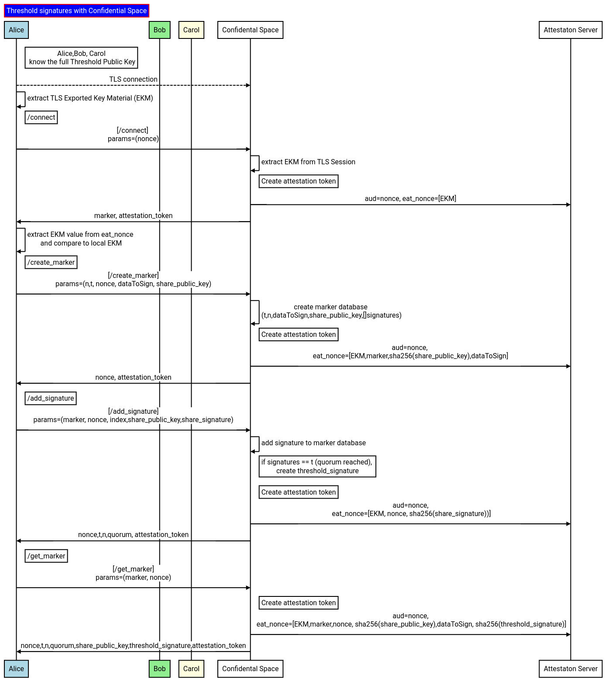

## Sign

  - [Server](#sign-server)
  - [Client](#sign-client)  


Threshold signatures requires each participant to submit a GCP KMS encrypted secret which either allows access to the threshold partial key of a participant or is the encrypted key itself.

Each participant will configure their own [Workload Identity Federation](https://cloud.google.com/iam/docs/workload-identity-federation) which authorizes access to _only_ a container image that is known to run this threshold signing server.

The server will use GCP Confidential Computes [attestation OIDC token](https://cloud.google.com/docs/security/confidential-space#components-of-a-confidential-space-system) to authenticate and access each participants KMS key and then decrypt the underlying threshold private key.

Once the server has the minimal threshold 

First a glossary 

* `marker`:  this is a UUID which signifies the parameters of the key to generate.  
  Think of this as a unique index value each participant uses to coordinate key transfers.  
  The uuid van only get generated by the server.
* `index`:  Threshold keys have ordinal/index values so for n=3, its index[1,2,3]
* `share_public_keys`:  Represents the list of BLS Threshold public keys the marker is coordinating in index value ordering
* `attestation`: The Confidential space JWT token used by participants to verify server characteristics

Now the using of API endpoints involved in the generation:

```golang
	router.Methods(http.MethodPost).Path("/connect").HandlerFunc(connectHandler)
	router.Methods(http.MethodPost).Path("/create_marker").HandlerFunc(createMarkerHandler)
	router.Methods(http.MethodPost).Path("/get_marker").HandlerFunc(getMarkerHandler)
	router.Methods(http.MethodPost).Path("/add_signature").HandlerFunc(addSignatureHandler)
```

#### `/connect`

The first and continuous step in any API call is for each client to confirm they are infact talking **directly** with a TEE on GCP Confidential space.

This is done by deriving the EKM value for the clients connection and getting the signed attestation jwt back from the server which includes that value.  Both the client and server derived the same value and that can only happen if the server terminated the TLS session.

The client will then verify the returned JWT from the server and compare against its value it got.   Once confirmed, the client will reuse this TLS connection.

Snippet below shows the API request/response and the values encoded into the attestation JWT


```golang
type ConnectRequest struct {
	Nonce string `json:"nonce"`   // random value to encode back int he attestation JWT
}

type ConnectResponse struct {
	Nonce          string `json:"nonce"`   // random nonce sent by the client
	AttestationJWT string `json:"attestation_jwt"`  // attestation_jwt with the EKM 
}

ttsa := customToken{
	Audience:  post.Nonce,    // the nonce as audience
	// eat_nonce encodes the ekm for the TLS connection
	Nonces:    []string{val.EKM},  
	TokenType: TOKEN_TYPE_OIDC,
}
customTokenValue, err = getCustomAttestation(ttsa)
```

#### `/create_marker`

The first step is to initialize a coordination marker.  

A marker is simply a server-generated unique identifier to coordinate the various participants requests and responses.

```golang
type CreateMarkerRequest struct {
	Nonce          string `json:"nonce"`  // random nonce sent by the client
	T              int    `json:"t"`   // min keys needed for a signature
	N              int    `json:"n"`   // total key for the signature
	SharePublicKey string `json:"share_public_key"`  // the overall threshold public key
	DataToSign     string `json:"data_to_sign"` // the data to sign.  This should be the sha256 of the actual raw data to sign
}

type CreateMarkerResponse struct {
	Uid            string `json:"uid"`   // the marker
	AttestationJWT string `json:"attestation_jwt"`  // attestation_jwt with the EKM
}


ttsa := customToken{
	Audience:  post.Nonce,  // the nonce sent in
	// eat_nonce encodes the ekm, marker, sha256(threshold_public_key), dataToSign
	Nonces:    []string{val.EKM, uid, base64.StdEncoding.EncodeToString(pkhsh), post.DataToSign},
	TokenType: TOKEN_TYPE_OIDC,
}
customTokenValue, err = getCustomAttestation(ttsa)
```

The response is the marker value which is given to all participants (the specific mechanism to distribute this marker isn't specified in this repo)

#### `add_signature`

Each participant should submit their threshold key to the server using the marker to coordinate:

The response will display the `t,n` values as well as the number of participants that have already submitted their partial signatures (`quorum`)

Server will also send back the TEE JWT attestation token where:

```golang
type AddSignatureRequest struct {
	Uid            string `json:"uid"`  // marker
	Nonce          string `json:"nonce"`  // random nonce sent by the client
	Index          int    `json:"index"`  // index value for the threshold participant
	Public         string `json:"share_public"`  // public key for the threshold participant
	SignatureShare string `json:"signature_share"`  // share signature for the participant 
}

type AddSignatureResponse struct {
	T              int    `json:"t"`
	N              int    `json:"n"`
	Quorum         int    `json:"quorum"`  // has the quorum been reached
	AttestationJWT string `json:"attestation_jwt"`
}

// eat_nonce encodes the EKM, marker, nonce and the sha256(threshold_signature)
eat_nonce := []string{val.EKM, post.Uid, post.Nonce, signatureHash}
ttsa := customToken{
	Audience:  post.Nonce,
	Nonces:    eat_nonce,
	TokenType: TOKEN_TYPE_OIDC,
}
customTokenValue, err = getCustomAttestation(ttsa)
```

#### `get_marker`

At anytime, any participant can request the specifications and state of the marker which will denote its:

```golang
type GetMarkerRequest struct {
	Uid   string `json:"uid"`   // marker
	Nonce string `json:"nonce"` // nonce 
}

type GetMarkerResponse struct {
	T              int    `json:"t"`   // min keys needed for a signature
	N              int    `json:"n"`   // total key for the signature
	Quorum         int    `json:"quorum"`  // number of signatures sent in so far.  if quorum==t, the threshold signature is issued
	SharePublicKey string `json:"share_public_key"`  // the overall threshold public key
	DataToSign     string `json:"data_to_sign"`   // sha256 of the raw data
	Signature      string `json:"signature"`   // the threshold signture; it is only present if quorum was reached
	AttestationJWT string `json:"attestation_jwt"`  // the attestation JWT
}


ttsa := customToken{
	Audience:  post.Nonce,
	// eat_nonce encodes the ekm, marker, nonce, sha256(threshold_public_key),dataToSign, sha256(threshold_signature)
	Nonces:    []string{val.EKM, post.Uid, post.Nonce, base64.StdEncoding.EncodeToString(puhsh), e.DataToSign, base64.StdEncoding.EncodeToString(sigsh)},
	TokenType: TOKEN_TYPE_OIDC,
}
customTokenValue, err = getCustomAttestation(ttsa)
```



---

#### Sign Server

To build run the server image,

Running locally requires `bazel` or `go 1.19+` 

```bash
# bazel run :gazelle -- update-repos -from_file=go.mod -prune=true -to_macro=repositories.bzl%go_repositories
## run a local registry
crane registry serve --address :4000

docker run  --net=host -e USER="$(id -u)" \
   -v $HOME/.docker/config.json:/root/.docker/config.json \
   -v `pwd`:/src/workspace   -v /tmp/build_output:/tmp/build_output \
   -v /var/run/docker.sock:/var/run/docker.sock   -w /src/workspace \
   gcr.io/cloud-builders/bazel@sha256:7c34604572d4f001928b98f2b04e2feaebce67b7933e4182b817dcbfe9904bcd run  server:push-image

## See the "Local Testing" section below
# docker run -p 8081:8081 -v `pwd`/certs/:/certs \
#     localhost:4000/sign-server@sha256:f00385461318c10f19a37856597eaecc3bbd33cad3aafe05e2c14e48096a87d8 \
#     --listen :8081 \
#     --tlsCert=/certs/server.crt \
#     --tlsKey=/certs/server.key \
#     --tlsCA=/certs/tls-ca-chain.pem \
#     --v=30 -alsologtostderr

# go run server/server.go  --listen :8081 \
#    --tlsCA=certs/tls-ca-chain.pem --tlsCert=certs/server.crt --tlsKey=certs/server.key \
#    --v=30 -alsologtostderr
```

```bash
gcloud config configurations activate operator

export OPERATOR_PROJECT_ID=`gcloud config get-value core/project`
export OPERATOR_PROJECT_NUMBER=`gcloud projects describe $OPERATOR_PROJECT_ID --format='value(projectNumber)'`

export IMAGE_HASH="index.docker.io/salrashid123/sign-server@sha256:f00385461318c10f19a37856597eaecc3bbd33cad3aafe05e2c14e48096a87d8"

gcloud iam service-accounts create operator-svc-account

gcloud projects add-iam-policy-binding $OPERATOR_PROJECT_ID \
  --member=serviceAccount:operator-svc-account@$OPERATOR_PROJECT_ID.iam.gserviceaccount.com  \
  --role=roles/logging.logWriter

gcloud compute firewall-rules create allow-tee-inbound-8081 --project $OPERATOR_PROJECT_ID \
    --action allow --direction INGRESS    --source-ranges 0.0.0.0/0     --target-tags tee-vm    --rules tcp:8081

gcloud compute instances create vm1 --confidential-compute \
 --shielded-secure-boot --tags=tee-vm --project $OPERATOR_PROJECT_ID \
 --maintenance-policy=TERMINATE --scopes=cloud-platform  --zone=us-central1-a \
 --image-project=confidential-space-images \
 --image=confidential-space-231201 \
 --service-account=operator-svc-account@$OPERATOR_PROJECT_ID.iam.gserviceaccount.com \
 --metadata ^~^tee-image-reference=$IMAGE_HASH~tee-restart-policy=Never~tee-container-log-redirect=true

export EXTERNAL_IP=`gcloud compute instances describe vm1 --project $OPERATOR_PROJECT_ID --zone=us-central1-a  --format='get(networkInterfaces[0].accessConfigs.natIP)'`
echo $EXTERNAL_IP
```

#### Sign Client


```bash
## sample threshold public key used for testing
export PUBLIC_KEY=WRkFZKRtXa6aVbaOvkxGldEUGkefkFyblAx8pPwW+7R7w5sZFQmfw4grVf308gmx9CtrG114D2zQ+Dib3FZUUgo8MoEmQ2xzfrg5niqrZn/JcYd0udvS1/brNpFiZcNQJXQg6VBSn/6/06ieBoquOJMiKp10sLA7W6vozEyL2ys=

## keys for participant 0
export SPU_0=h3z06n1WzwwCUeBNxvtpMPe+h/a/R7l2Ijt2tBdbiGFakhxJl4TGw0z1uvtLcvsCbiF70JGm2GO0aSKOvcZrlyx0cdJ+018/xrAd4ddYV71ALGHqwGTy4Iv0pdfbkf+GJoNgTXxNeWD6pp/tHMkD84VuZOJLq2b9HjA/sGt1hmM=
export SPR_0=f3XWEXerV165Yasp/YmwARaBwmoCQhJ+qpue3CkW6tw=

## keys for participant 1
export SPU_1=UnhqQD6emCbDnHd55GzRSLDcWDbDJxOPVkOwG/VQgcgdzoXLr+dZ6b2LGBUx2xO8wFdxNGEo8EL5XuJ1/HPfBCA7p56a8QgKdw5xrrKctQoA/CCXUti6VCK0MTlh+E+6Zp2yNQLx4eP0b7fIoFJDP4ES0DgzkzJmMPM71FWLtyw=
export SPR_1=ZOJ7NQ5Q3dSIgZiuzo/oXN38T//nmWbwlfD8dUiOEDc=

## keys for participant 2
export SPU_2=DKjWeq8Rv9pFlgTLKB3gRs9KXEHONGiLg/aAul4cQMGB5TpMNlXBWl6NiSaSXGy7j0mTD5AZpNmY+BWp7oJ8gQfPRcE+uHZTAbi3iQ0Uew2oEhNYAY8bs2j6Mpdg3lGLcKdC8+mww3iyXN6vqvbr7QtUZccYTO91fW28Wq028ZY=
export SPR_2=Sk8gWKT2ZEpXoYYzn5YguKV23ZXM8LtigUZaDmgFNZI=

# any participant with the threshold public key can create a marker.  In this case, sign with 2 of 3 keys
go run client/client.go   --host $EXTERNAL_IP:8081 --mode create_marker \
   --TLSCACert=certs/tls-ca-chain.pem   \
   --t 2 --n 3 --dataToSign=some-data-to-sign --audience=bar --sharePublicKey=$PUBLIC_KEY \
   --nonce=some-random-nonce-value \
    --v=10 -alsologtostderr

## read the marker value
go run client/client.go  --host $EXTERNAL_IP:8081 \
   --marker $MARKER --dataToSign=some-data-to-sign --audience=foo \
   -sharePublicKey=$PUBLIC_KEY --mode get_marker --TLSCACert=certs/tls-ca-chain.pem \
   --nonce=some-random-nonce-value \
   --v=20 -alsologtostderr

# submit a signature for participant 0
go run client/client.go  --host $EXTERNAL_IP:8081 --marker $MARKER \
   --mode add_signature --index=0 --share_public_key $SPU_0 --share_private_key=$SPR_0 \
    --dataToSign=some-data-to-sign  --audience=foo --TLSCACert=certs/tls-ca-chain.pem \
	--nonce=some-random-nonce-value \
	--v=20 -alsologtostderr

# submit a signature for participant 1
go run client/client.go  --host $EXTERNAL_IP:8081 --marker $MARKER --mode add_signature \
   --index=1 --share_public_key $SPU_1 --share_private_key=$SPR_1 \
    --dataToSign=some-data-to-sign  --audience=foo --TLSCACert=certs/tls-ca-chain.pem \
	--nonce=some-random-nonce-value \
	--v=20 -alsologtostderr

# submit a signature for participant 2
go run client/client.go  --host $EXTERNAL_IP:8081 --marker $MARKER \
   --mode add_signature --index=2 --share_public_key $SPU_2 --share_private_key=$SPR_2 \
    --dataToSign=some-data-to-sign  --audience=foo --TLSCACert=certs/tls-ca-chain.pem \
	--nonce=some-random-nonce-value \
	--v=20 -alsologtostderr

# once the signature is generated, any participant can read the marker and see the value
go run client/client.go  --host $EXTERNAL_IP:8081 \
   --marker $MARKER --dataToSign=some-data-to-sign --audience=foo \
   -sharePublicKey=$PUBLIC_KEY --mode get_marker --TLSCACert=certs/tls-ca-chain.pem \
   --nonce=some-random-nonce-value \
   --v=20 -alsologtostderr	
```

---

### Local Testing

The sample code also allows for local testing which uses a ['fake' attestation JWT issuer](https://github.com/salrashid123/confidential_space/tree/main/misc/testtoken).

To use this, you need to supply the server with `--useTestIssuer` flag:

```bash
go run server/server.go  --listen :8081 \
   --tlsCA=certs/tls-ca-chain.pem --tlsCert=certs/server.crt --tlsKey=certs/server.key \
   --useTestIssuer \
   --v=30 -alsologtostderr
```

then on the client, specify the allowed issuer

```bash
export EXTERNAL_IP=127.0.0.1

## remember to export the example threshold keys cited earlier
go run client/client.go   --host $EXTERNAL_IP:8081 --mode create_marker \
   --TLSCACert=certs/tls-ca-chain.pem   \
   --t 2 --n 3 --dataToSign=some-data-to-sign --audience=bar --sharePublicKey=$PUBLIC_KEY \
   --nonce=some-random-nonce-value \
  --allowedImageReference="docker.io/salrashid123/myimage@sha256:9ec06569f1c169d4c5b380c64b803d287468d95429dab4e4449842f93a252049" \
  --allowedIssuer="https://idp-on-cloud-run-3kdezruzua-uc.a.run.app" \
  --allowedJWKURL="https://idp-on-cloud-run-3kdezruzua-uc.a.run.app/certs" \
   --v=10 -alsologtostderr

go run client/client.go  --host $EXTERNAL_IP:8081 \
   --marker $MARKER --dataToSign=some-data-to-sign --audience=foo \
   -sharePublicKey=$PUBLIC_KEY --mode get_marker --TLSCACert=certs/tls-ca-chain.pem \
   --nonce=some-random-nonce-value \
     --allowedImageReference="docker.io/salrashid123/myimage@sha256:9ec06569f1c169d4c5b380c64b803d287468d95429dab4e4449842f93a252049" \
  --allowedIssuer="https://idp-on-cloud-run-3kdezruzua-uc.a.run.app" \
  --allowedJWKURL="https://idp-on-cloud-run-3kdezruzua-uc.a.run.app/certs" \
  --v=20 -alsologtostderr

go run client/client.go  --host $EXTERNAL_IP:8081 --marker $MARKER \
   --mode add_signature --index=0 --share_public_key $SPU_0 --share_private_key=$SPR_0 \
    --dataToSign=some-data-to-sign  --audience=foo --TLSCACert=certs/tls-ca-chain.pem \
	--nonce=some-random-nonce-value  \
	  --allowedImageReference="docker.io/salrashid123/myimage@sha256:9ec06569f1c169d4c5b380c64b803d287468d95429dab4e4449842f93a252049" \
  --allowedIssuer="https://idp-on-cloud-run-3kdezruzua-uc.a.run.app" \
  --allowedJWKURL="https://idp-on-cloud-run-3kdezruzua-uc.a.run.app/certs" \
   --v=20 -alsologtostderr

go run client/client.go  --host $EXTERNAL_IP:8081 --marker $MARKER --mode add_signature \
   --index=1 --share_public_key $SPU_1 --share_private_key=$SPR_1 \
    --dataToSign=some-data-to-sign  --audience=foo --TLSCACert=certs/tls-ca-chain.pem \
	--nonce=some-random-nonce-value  \
	  --allowedImageReference="docker.io/salrashid123/myimage@sha256:9ec06569f1c169d4c5b380c64b803d287468d95429dab4e4449842f93a252049" \
  --allowedIssuer="https://idp-on-cloud-run-3kdezruzua-uc.a.run.app" \
  --allowedJWKURL="https://idp-on-cloud-run-3kdezruzua-uc.a.run.app/certs" \
   --v=20 -alsologtostderr

go run client/client.go  --host $EXTERNAL_IP:8081 --marker $MARKER \
   --mode add_signature --index=2 --share_public_key $SPU_2 --share_private_key=$SPR_2 \
    --dataToSign=some-data-to-sign  --audience=foo --TLSCACert=certs/tls-ca-chain.pem \
	--nonce=some-random-nonce-value  \
	--allowedImageReference="docker.io/salrashid123/myimage@sha256:9ec06569f1c169d4c5b380c64b803d287468d95429dab4e4449842f93a252049" \
	 --allowedIssuer="https://idp-on-cloud-run-3kdezruzua-uc.a.run.app" \
  --allowedJWKURL="https://idp-on-cloud-run-3kdezruzua-uc.a.run.app/certs" \
   --v=20 -alsologtostderr


go run client/client.go  --host $EXTERNAL_IP:8081 \
   --marker $MARKER --dataToSign=some-data-to-sign --audience=foo \
   -sharePublicKey=$PUBLIC_KEY --mode get_marker --TLSCACert=certs/tls-ca-chain.pem \
   --nonce=some-random-nonce-value \
     --allowedImageReference="docker.io/salrashid123/myimage@sha256:9ec06569f1c169d4c5b380c64b803d287468d95429dab4e4449842f93a252049" \
  --allowedIssuer="https://idp-on-cloud-run-3kdezruzua-uc.a.run.app" \
  --allowedJWKURL="https://idp-on-cloud-run-3kdezruzua-uc.a.run.app/certs" \
  --v=20 -alsologtostderr   
```

sample output

- `server`

```log
$ go run server/server.go  --listen :8081 \
   --tlsCA=certs/tls-ca-chain.pem --tlsCert=certs/server.crt --tlsKey=certs/server.key \
   --useTestIssuer \
   --v=30 -alsologtostderr
I0108 18:16:43.055797 1147634 server.go:529] Enabling Test Attestation Token Issuer
I0108 18:16:43.666374 1147634 server.go:85] --------------------------------
I0108 18:16:54.439827 1147634 server.go:103] EKM my_nonce: 1b9584823d65346eb9b6f46f952cd2f9ba9b3092f6c5cdfa4825fceca512353b
I0108 18:16:54.439856 1147634 server.go:124] Got Connect request
I0108 18:16:54.519443 1147634 server.go:103] EKM my_nonce: 1b9584823d65346eb9b6f46f952cd2f9ba9b3092f6c5cdfa4825fceca512353b
I0108 18:16:54.519526 1147634 server.go:167] Got CreateMarker request

I0108 18:17:08.000070 1147634 server.go:103] EKM my_nonce: 7aec1a023c6499acbe6e8a60b010682a67cb0b93e96894ed3a983b3d57f06e99
I0108 18:17:08.000104 1147634 server.go:124] Got Connect request
I0108 18:17:08.071830 1147634 server.go:103] EKM my_nonce: 7aec1a023c6499acbe6e8a60b010682a67cb0b93e96894ed3a983b3d57f06e99
I0108 18:17:08.071869 1147634 server.go:252] Got GetMarker request

I0108 18:17:14.114281 1147634 server.go:103] EKM my_nonce: c58ffc3c727aacb3d10316eb4e8fc0e82baf2747ddd1ded1c79b8f64853af704
I0108 18:17:14.114306 1147634 server.go:124] Got Connect request
I0108 18:17:14.232605 1147634 server.go:103] EKM my_nonce: c58ffc3c727aacb3d10316eb4e8fc0e82baf2747ddd1ded1c79b8f64853af704
I0108 18:17:14.232650 1147634 server.go:333] Got SignMarker request

I0108 18:17:19.299277 1147634 server.go:103] EKM my_nonce: d782ec904ec0f392b7e97d3201a815146ff18921a81a0e3d05459617283db6ee
I0108 18:17:19.299300 1147634 server.go:124] Got Connect request
I0108 18:17:19.379211 1147634 server.go:103] EKM my_nonce: d782ec904ec0f392b7e97d3201a815146ff18921a81a0e3d05459617283db6ee
I0108 18:17:19.379275 1147634 server.go:333] Got SignMarker request

I0108 18:17:19.379339 1147634 server.go:367] Threshold Reached for marker 00a1c5a1-29c8-455e-941b-12168ef12fa2

I0108 18:17:38.360968 1147634 server.go:124] Got Connect request
I0108 18:17:38.459061 1147634 server.go:103] EKM my_nonce: 7539c13918143d484ec6439f99a348c41ca30728bf7a30b96ee2550dc127673c
I0108 18:17:38.459139 1147634 server.go:252] Got GetMarker request

```

- `client`

```bash
$ export EXTERNAL_IP=127.0.0.1

## remember to export the example threshold keys cited earlier

$ export EXTERNAL_IP=127.0.0.1

## remember to export the example threshold keys cited earlier

go run client/client.go   --host $EXTERNAL_IP:8081 --mode create_marker \
   --TLSCACert=certs/tls-ca-chain.pem   \
   --t 2 --n 3 --dataToSign=some-data-to-sign --audience=bar --sharePublicKey=$PUBLIC_KEY \
   --nonce=some-random-nonce-value \
  --allowedImageReference="docker.io/salrashid123/myimage@sha256:9ec06569f1c169d4c5b380c64b803d287468d95429dab4e4449842f93a252049" \
  --allowedIssuer="https://idp-on-cloud-run-3kdezruzua-uc.a.run.app" \
  --allowedJWKURL="https://idp-on-cloud-run-3kdezruzua-uc.a.run.app/certs" \
   --v=10 -alsologtostderr
I0108 18:16:54.436633 1147846 client.go:143] ========================== Connecting /connect ==========================
I0108 18:16:54.518834 1147846 client.go:228] ========================== Create Marker ==========================
I0108 18:16:54.525512 1147846 client.go:285] >>>>>>>>>>>>>>>>>>>>>>>>>>>>>>> Marker: 00a1c5a1-29c8-455e-941b-12168ef12fa2 <<<<<<<<<<<<<<<<<<<<<<<<<<<<<<<<<

$ export MARKER=00a1c5a1-29c8-455e-941b-12168ef12fa2

$ go run client/client.go  --host $EXTERNAL_IP:8081 \
   --marker $MARKER --dataToSign=some-data-to-sign --audience=foo \
   -sharePublicKey=$PUBLIC_KEY --mode get_marker --TLSCACert=certs/tls-ca-chain.pem \
   --nonce=some-random-nonce-value \
     --allowedImageReference="docker.io/salrashid123/myimage@sha256:9ec06569f1c169d4c5b380c64b803d287468d95429dab4e4449842f93a252049" \
  --allowedIssuer="https://idp-on-cloud-run-3kdezruzua-uc.a.run.app" \
  --allowedJWKURL="https://idp-on-cloud-run-3kdezruzua-uc.a.run.app/certs" \
  --v=20 -alsologtostderr
I0108 18:17:07.996859 1148017 client.go:143] ========================== Connecting /connect ==========================
I0108 18:17:07.999691 1148017 client.go:105] Server Subject CN=sign.domain.com,OU=Enterprise,O=Google,C=US
I0108 18:17:08.001965 1148017 client.go:179] EKM my_nonce: 7aec1a023c6499acbe6e8a60b010682a67cb0b93e96894ed3a983b3d57f06e99
I0108 18:17:08.071564 1148017 client.go:330] ========================== Get Marker ==========================
I0108 18:17:08.076883 1148017 client.go:454] Share Public Key: WRkFZKRtXa6aVbaOvkxGldEUGkefkFyblAx8pPwW+7R7w5sZFQmfw4grVf308gmx9CtrG114D2zQ+Dib3FZUUgo8MoEmQ2xzfrg5niqrZn/JcYd0udvS1/brNpFiZcNQJXQg6VBSn/6/06ieBoquOJMiKp10sLA7W6vozEyL2ys=
I0108 18:17:08.076977 1148017 client.go:455] Signature : 

$ go run client/client.go  --host $EXTERNAL_IP:8081 --marker $MARKER \
   --mode add_signature --index=0 --share_public_key $SPU_0 --share_private_key=$SPR_0 \
    --dataToSign=some-data-to-sign  --audience=foo --TLSCACert=certs/tls-ca-chain.pem \
        --nonce=some-random-nonce-value  \
          --allowedImageReference="docker.io/salrashid123/myimage@sha256:9ec06569f1c169d4c5b380c64b803d287468d95429dab4e4449842f93a252049" \
  --allowedIssuer="https://idp-on-cloud-run-3kdezruzua-uc.a.run.app" \
  --allowedJWKURL="https://idp-on-cloud-run-3kdezruzua-uc.a.run.app/certs" \
   --v=20 -alsologtostderr
I0108 18:17:14.110758 1148104 client.go:143] ========================== Connecting /connect ==========================
I0108 18:17:14.113804 1148104 client.go:105] Server Subject CN=sign.domain.com,OU=Enterprise,O=Google,C=US
I0108 18:17:14.116221 1148104 client.go:179] EKM my_nonce: c58ffc3c727aacb3d10316eb4e8fc0e82baf2747ddd1ded1c79b8f64853af704
I0108 18:17:14.231757 1148104 client.go:458] ========================== Add Signature ==========================
I0108 18:17:14.232241 1148104 client.go:486] Private Share 0: 7f75d61177ab575eb961ab29fd89b0011681c26a0242127eaa9b9edc2916eadc
I0108 18:17:14.232287 1148104 client.go:487] Share Signature 0: AAAGsZNvNJ3McTIE0AWq+LVSf55zoiErV6yZW10ZDbVrmUvSYlUNbWPUK/1TLW2d4/2R2hloiXVqhOAcJxaDz8TK
I0108 18:17:14.237426 1148104 client.go:552] Quorum 1


$ go run client/client.go  --host $EXTERNAL_IP:8081 --marker $MARKER --mode add_signature \
   --index=1 --share_public_key $SPU_1 --share_private_key=$SPR_1 \
    --dataToSign=some-data-to-sign  --audience=foo --TLSCACert=certs/tls-ca-chain.pem \
        --nonce=some-random-nonce-value  \
          --allowedImageReference="docker.io/salrashid123/myimage@sha256:9ec06569f1c169d4c5b380c64b803d287468d95429dab4e4449842f93a252049" \
  --allowedIssuer="https://idp-on-cloud-run-3kdezruzua-uc.a.run.app" \
  --allowedJWKURL="https://idp-on-cloud-run-3kdezruzua-uc.a.run.app/certs" \
   --v=20 -alsologtostderr
I0108 18:17:19.296175 1148186 client.go:143] ========================== Connecting /connect ==========================
I0108 18:17:19.298883 1148186 client.go:105] Server Subject CN=sign.domain.com,OU=Enterprise,O=Google,C=US
I0108 18:17:19.301119 1148186 client.go:179] EKM my_nonce: d782ec904ec0f392b7e97d3201a815146ff18921a81a0e3d05459617283db6ee
I0108 18:17:19.377877 1148186 client.go:458] ========================== Add Signature ==========================
I0108 18:17:19.378667 1148186 client.go:486] Private Share 1: 64e27b350e50ddd4888198aece8fe85cddfc4fffe79966f095f0fc75488e1037
I0108 18:17:19.378741 1148186 client.go:487] Share Signature 1: AAEjzvf94g0Df9x3ACndWZUatRQHCDOJjjJ5+7Ym4CYuL3I3lkyvy8fe1+Ny3lOcKX2phZxOSCMslYi29mz6MrLu
I0108 18:17:19.396598 1148186 client.go:552] Quorum 2


$ go run client/client.go  --host $EXTERNAL_IP:8081 \
   --marker $MARKER --dataToSign=some-data-to-sign --audience=foo \
   -sharePublicKey=$PUBLIC_KEY --mode get_marker --TLSCACert=certs/tls-ca-chain.pem \
   --nonce=some-random-nonce-value \
     --allowedImageReference="docker.io/salrashid123/myimage@sha256:9ec06569f1c169d4c5b380c64b803d287468d95429dab4e4449842f93a252049" \
  --allowedIssuer="https://idp-on-cloud-run-3kdezruzua-uc.a.run.app" \
  --allowedJWKURL="https://idp-on-cloud-run-3kdezruzua-uc.a.run.app/certs" \
  --v=20 -alsologtostderr
I0108 18:17:38.357608 1148359 client.go:143] ========================== Connecting /connect ==========================
I0108 18:17:38.360584 1148359 client.go:105] Server Subject CN=sign.domain.com,OU=Enterprise,O=Google,C=US
I0108 18:17:38.362890 1148359 client.go:179] EKM my_nonce: 7539c13918143d484ec6439f99a348c41ca30728bf7a30b96ee2550dc127673c
I0108 18:17:38.458423 1148359 client.go:330] ========================== Get Marker ==========================
I0108 18:17:38.466676 1148359 client.go:454] Share Public Key: WRkFZKRtXa6aVbaOvkxGldEUGkefkFyblAx8pPwW+7R7w5sZFQmfw4grVf308gmx9CtrG114D2zQ+Dib3FZUUgo8MoEmQ2xzfrg5niqrZn/JcYd0udvS1/brNpFiZcNQJXQg6VBSn/6/06ieBoquOJMiKp10sLA7W6vozEyL2ys=
I0108 18:17:38.466801 1148359 client.go:455] Signature : MC2uXN8PAj+8Avq1Y9SDiiRYFnpAQ1svCfJgVzJO1xtTOTnJ4J+vvb1jqefR6JLBs9awp2vRg/2V1oS/Fcu06Q==
```

the final threshold signature is `MC2uXN8PAj+8Avq1Y9SDiiRYFnpAQ1svCfJgVzJO1xtTOTnJ4J+vvb1jqefR6JLBs9awp2vRg/2V1oS/Fcu06Q==`